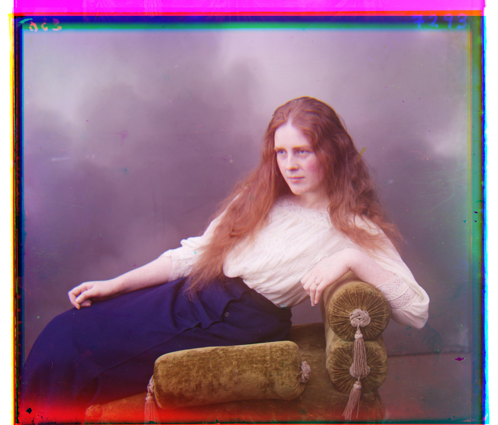
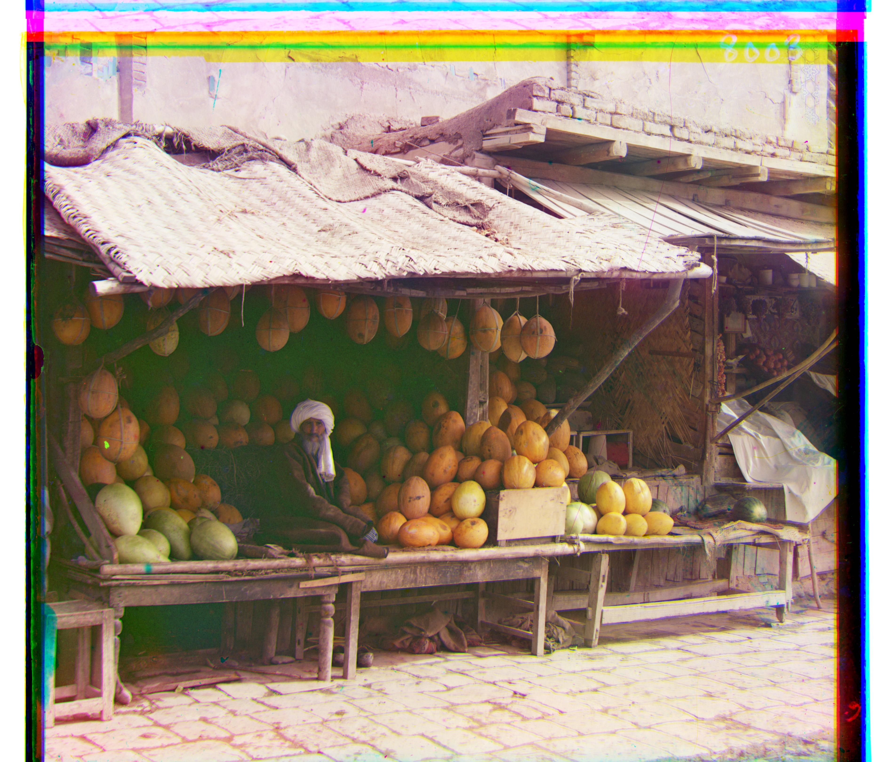

# CS 180 Project 1: Images of the Russian Empire: Colorizing the [Prokudin-Gorskii](https://www.loc.gov/collections/prokudin-gorskii/) photo collection

## Introduction 

The Prokudin-Gorskii photo collection is a historical archive containing more than 10,000 glass plate images captured between 1908 and 1915 by Russian photographer Sergei Mikhailovich Prokudin-Gorskii. These photographs offer a rare view into the daily life, architecture, and landscapes of the Russian Empire during a time of profound political and social transformation. Library of Congress digitaized the negatives of these RGB glass plate and made them available to the public.

## Implementation

### Exhausive Search

The naive approach iterates over all possible shifts in both x and y directions within a window of 15 pixels. Given one channel as the base and another as the moving channel, the alignment score is evaluated at each step. In this project, I utilized two different scoring metrics: L2 norm and normalized cross-correlation (NCC). Of the two, I found that the L2 norm performed best for my purposes. Using nested loops, I implemented the `find_displacement_naive` function, which computes the best displacement between two image channels.

1. **L2 Norm (Sum of Squared Differences)** is defined as:

$$
   \text{L2 Norm} = \sum \sum \left( (\text{image1} - \text{image2})^2 \right)
$$

2. **Normalized Cross-Correlation (NCC)** is defined as:

$$
   \text{NCC} = \frac{\text{image1}}{||\text{image1}||} \cdot \frac{\text{image2}}{||\text{image2}||}
$$

The following images performed the best using the naive exhausive search:

Displacement: G: (1, -1), R: (7, -1)

Displacement: G: (-6, 0), R: (9, 1)

Displacement: G: (15, -3), R: (15, -2)

### Pyramid Search

Pyramid search recursively scale down the image by half and perform alignment on scaled images for a more accurate performance. I implemented the `find_displacement_pyramid` on top of the `find_displacement_naive`. It drastically reduce the runtime and improved performance. The difficult part is to find the window size. I have tried to set window size to be a constant number and dynamically adjust the window size as the scaling factor increases. However, the later approach will increase the runtime, while adding limited performace increase. Hence, to balance the runtime and performance, I have choosen to set constant number 7 to be the optimal window size for all images. 

The following images performed the best using the naive exhausive search:

Displacement: G: (-6, 0), R: (9, 1)

Displacement: G: (-61593, -59836) , R: (-61547, -59830)

Displacement: G: (-64184, -60178) , R: (-64118, -60188)

Displacement: G: (-61490, -60316)  , R: (-64636, -60312)

Displacement: G: (-64256, -60470), R: (-64200, -60458)

Displacement: G: (33, -11), R: (140, -26)

Displacement: G: (50, -2) , R: (130, -5)

Displacement: G: (52, 5) , R: (108, 7) 

Displacement: G: (3, 2), R: (6, 3)

Displacement: G: (111, -7) , R: (107, 1)
