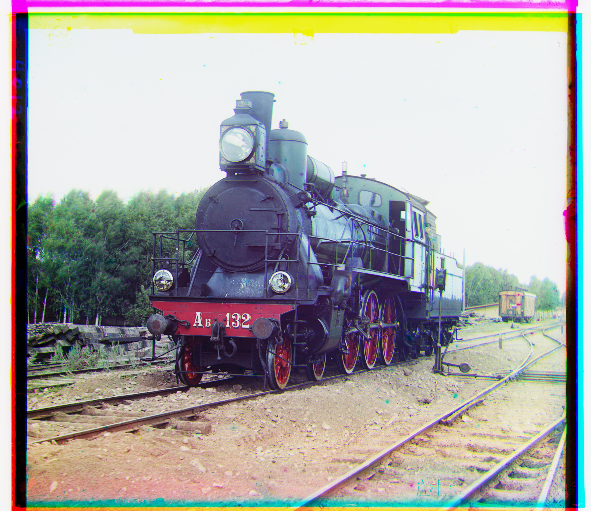

# CS 180 Project 1: Images of the Russian Empire: Colorizing the [Prokudin-Gorskii](https://www.loc.gov/collections/prokudin-gorskii/) photo collection

## Introduction 

The Prokudin-Gorskii photo collection is a historical archive containing more than 10,000 glass plate images captured between 1908 and 1915 by Russian photographer Sergei Mikhailovich Prokudin-Gorskii. These photographs offer a rare view into the daily life, architecture, and landscapes of the Russian Empire during a time of profound political and social transformation. Library of Congress digitaized the negatives of these RGB glass plate and made them available to the public.

## Implementation

### Exhausive Search

The naive approach iterates over all possible shifts in both x and y directions within a window of 15 pixels. Given one channel as the base and another as the moving channel, the alignment score is evaluated at each step. In this project, I utilized two different scoring metrics: L2 norm and normalized cross-correlation (NCC). Of the two, I found that the L2 norm performed best for my implementation. Using nested loops, I implemented the `find_displacement_naive` function, which computes the best displacement between two image channels.

1. **L2 Norm (Sum of Squared Differences)** is defined as:

$$
   \text{L2 Norm} = \sum \sum \left( (\text{image1} - \text{image2})^2 \right)
$$

2. **Normalized Cross-Correlation (NCC)** is defined as:

$$
   \text{NCC} = \frac{\text{image1}}{||\text{image1}||} \cdot \frac{\text{image2}}{||\text{image2}||}
$$

#### Single-scale implementation is being used on the following low-res images:

Size: 165K
Displacement G: (5, 2), R: (12, 3)

Size: 152K
Displacement G: (-3, 0), R: (3, 1)

Displacement G: (3, 3), R: (6, 3)

Size: 173K

### Pyramid Search

The pyramid search algorithm recursively scales down the image by half and performs alignment on the scaled images to improve accuracy. I implemented the `find_displacement_pyramid` function on top of `find_displacement_naive`, which significantly reduced runtime and enhanced performance. In this case, I found that using NCC further improved the results. The challenge was determining the optimal number of pyramid layers. Setting a fixed number of layers is not ideal because different image sizes require different numbers of layers. Therefore, I ensured that the smallest image had at least 16 pixels and calculated the number of layers using a logarithmic function.

I also experimented with dynamically adjusting the window size as the scaling factor increased, but this resulted in longer runtimes without noticeable performance improvements. To balance runtime and accuracy, I chose a constant window size of 8 as the optimal value for all images. 

### Multiscale pyramid implementation on the following large images

Displacement G: (25, 4), R: (58, -4)

Displacement G: (49, 24), R: (107, 40)

Displacement G: (60, 17), R: (124, 14)

Displacement G: (42, 16), R: (89, 22)

Displacement G: (56, 9), R: (120, 13)

Displacement G: (80, 10), R: (177, 13)

Displacement G: (51, 26), R: (108, 36)

Displacement G: (33, -11), R: (139, -26)

Displacement G: (78, 29), R: (176, 37)

Displacement G: (54, 12), R: (111, 9)

Displacement G: (41, 2), R: (85, 29)

### Additional Techniques (Extra Credit)

However, some images did not perform as expected with approches described above, so I incorporated additional techniques described below for those cases. There are two additional refinement techniques I used: finding gradient and cropping. Sobel gradient acts as a edge detection filter. Conceptually, it highlights the part that is important to the image's change of intensity. Therefore, adding this feature help alignment to be more accurate. Typically, borders does not help alignment process. Hence, croping the outer borader of the image eliminate certain noise that might be inconsistent with the image data. 

Here is an example using gradient and cropping

Before 

After
