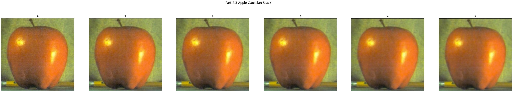
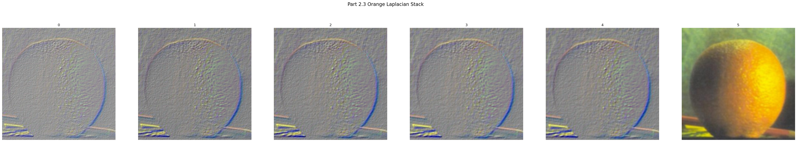

# CS 180 Project 2: Fun with Filters and Frequencies!

## Introduction 
In this project, we explore the purpose of filters and frequencies. 

## Part 1: Fun with Filters

### Finite Difference Operator

#### Method

First, we construct two vectors, Dx and Dy, as shown below. These vectors are then convolved with the image to produce partial derivative images, which are displayed in Figure Part 1.1: Partial Derivatives. Specifically, Image Dx highlights horizontal intensity changes, while Image Dy captures vertical intensity changes. By computing the L2 norm of these partial derivatives, we derive the gradient magnitude image, which quantifies the rate of intensity change in the original image. To enhance object boundaries, a threshold is applied to the gradient magnitude image, resulting in a binarized edge image. In the result shown in Figure Part 1.1: Finite Difference Operator, the threshold is set to balance the noise in foreground and the clarity of the buildings in the background. Views can still see the noise from the grass. Hence, we can improve it using a DoG filter.

$$
\mathbf{D_x} = \begin{bmatrix} 1 & -1 \end{bmatrix}, \quad \mathbf{D_y} = \begin{bmatrix} 1 \\ -1 \end{bmatrix},
$$

### Derivative of Gaussian (DoG) Filter
#### Method

We can apply a Gaussian filter to the input image for a smoothing effect, reducing noise and producing a clearer output when we repeat the previous steps on the smoothed image. The overall edge detection becomes more refined, with noise in the foreground disappearing while preserving the edges of the cameraman and the camera set. Using the same threshold, we can achieve a much clearer edge image.

Alternatively, we can combine these two steps into one by creating a Difference of Gaussians (DoG) filter. Convolving the image with the DoG filter in a single step achieves both smoothing and edge detection, producing the same result more efficiently.

## Part 2: Fun with Frequencies!

### Image "Sharpening"

To obtain a sharpened image, we need to enhance the high-frequency components of the image. This can be achieved by subtracting a blurred version of the image, created using a Gaussian filter, from the original image. The resulting high frequencies are then added back to the original image, along with a scaling factor $\alpha$, which controls the degree of sharpening. Mathematically, we get the below formula: 

$$
f + \alpha \cdot \left( f - (f * g) \right) = f * \left( (1 + \alpha) \cdot e - \alpha \cdot g \right)
$$

`f` represents the original image  
`e` represents the unit impulse  
`g` represents the gaussian  
`*` represents convolution   

Below are the results of two applications of unsharp masking.

Once we re-apply unsharp mask on the already sharpened Taj, we get a even sharper image but the detail is lossing and the image quality appears to be worse than the orignal image. 

### Hybrid Images

#### Taj and SF Civic Center
Given two images, our task is to blend them into one. First, we align the two images. To achieve the blending, we need both a low-pass and a high-pass filter. The low-pass filter is obtained by applying a Gaussian filter to the image, while the high-pass filter is created by subtracting the Gaussian-filtered image from the original. By combining these, we produce a hybrid image. In the first example below, we blend the Taj Mahal with the SF Civic Center. Due to the structural similarity, we align the images by matching the domes. The Taj Mahal serves as the low-pass image, while the Civic Center acts as the high-pass image. From a distance, the Civic Center's shape is more prominent, but when viewed up close, the Taj Mahal becomes clearer.

Here is the Fourier analysis. Given two input images, we convert one into the low-pass and the other into the high-pass filter, then combine them. In the final image, we can clearly see how the shapes from both filtered images merge together as one.

#### Campanile and Big Ben
Here we are blending the Campanile and Big Ben by the top and bottom point of the towers. We can see that the clock aligns perfectly, making them into a unity. From a distance, we can clearly see the shape of Big Ben, and Campanile is visiable as well.

#### Desert and Beach (Failure)

This blend is unsatisfactory, regardless of the parameters used. The mismatch can occur for various reasons, with one of the most apparent being the lack of structural similarity between the two images. Additionally, the differing color schemes make blending more challenging.

### Multiresolution Blending

#### Gaussian and Laplacian Stacks
Unlike pyramids, stacks do not downsample at each layer.   
In a **Gaussian stack**, we start with the original image, apply a Gaussian filter to the most recent image in the stack, and add the result to the stack.   
The **Laplacian stack** is formed by subtracting the image at level \(N+1\) from the image at level \(N\) in the Gaussian stack. For the final layer, where no further subtraction is possible, we simply add the last image from the Gaussian stack directly to the Laplacian stack.

Below are the Gaussian and Laplacian stacks for the apple and orange images. We observe that both stacks have the same number of layers. The first image in the Gaussian stack is the original image, while the last image in the Laplacian stack is the final layer from the Gaussian stack.

#### Oraple! 
Using the Gaussian and Laplacian stacks we implemented, we can create a blended image. For a vertical split, we set the mask to divide the image into left and right halves and generate a Gaussian stack for the mask. At each layer, we blend the apple using the mask and the orange using 
1 − mask. The two are then added together layer by layer. Finally, we collapse the stacks to reconstruct a full-resolution image. Oraple!

#### Moon Beach
Here, we revisit our previous attempt at creating a hybrid image using the desert and beach images. To achieve a better blend, we focus on an object that can be accurately extracted: the moon. Unlike before, we apply a circular mask to isolate the moon. By using the same blending techniques, we successfully merge elements of the desert image into the beach scene.

#### 100 SpongeBob Dollar $$$
We blended the images while adding a vintage feel to SpongeBob to achieve a smoother integration between the two.

