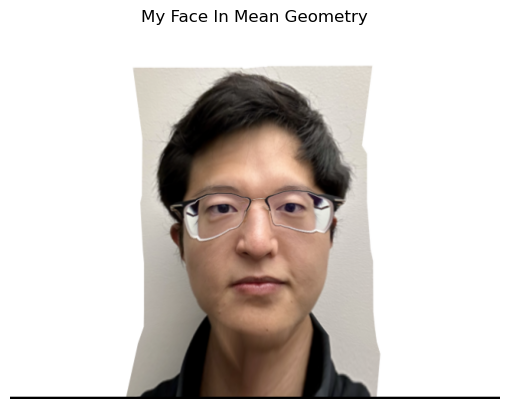
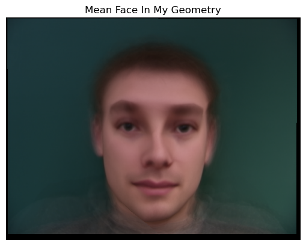
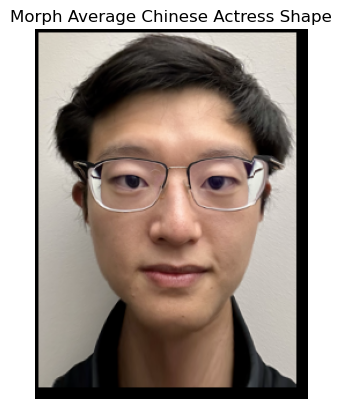

# CS 180 Project 3: Face Morphing

## Introduction 
In this project, we explore the concept of morphing—a process of transforming one image into another. For this demonstration, I use my own photo, a photo of George Clooney taken by photographer Martin Schoeller, the Danes dataset, and a photo representing an average Chinese actress.

## Part 1. Defining Correspondences
First, we use an existing labeling tool to mark several key points on both images. Then, we create Delaunay triangles for the two images, as shown below.

 

## Part 2. Computing the "Mid-way Face"
Once we have the defined points, we can compute the mid-way face between George and myself. I created a morph function designed for both Part 2 and Part 3. This function relies on a few helper functions, including `get_vertices`, `warp`, `dissolve`, and `polygon` from `skimage.draw` to create masks.

1. Using the defined points, we calculate their mean to determine the average shape. Then, we create a mid-way Delaunay triangulation using these average points.

2. To warp both faces into the average shape, we need to compute the transformation matrix A that maps each original image’s triangle to the corresponding triangle in the Delaunay triangulation. We then apply the inverse of A to perform the transformation. This process is repeated for every triangle.

3. Finally, we cross-dissolve the results by averaging the two warped images.

The result is shown below. Notice that the overall shape looks good, though there are subtle signs of transformation, especially around the glasses.

## Part 3. The Morph Sequence
Using the morph function created in Part 2, I generated a morph sequence consisting of 45 frames to illustrate the morphing process.

## Part 4. The "Mean face" of a population
To compute an average face for multiple input faces, I revised the morph function to better suit the Danes dataset. The dataset includes 37 images—30 Danish males and 7 Danish females. First, I created a function called `load_asf` to extract the defined image points from the ASF files. To align each image with its corresponding defined data points, I used a dictionary to store them.

I then used `average_delaunay` to compute the average shape and warped all the images to match this shape. Below are two examples. You can see how their faces become wider or narrower based on the average shape.

Next, I averaged all the warped images to obtain the average face for the entire dataset.

 

I morphed my image to match the "mean face" shape.

 

I also morphed the "mean face" to match my face shape.

 

## Part 5. Caricatures: Extrapolating from the mean
Using the mean from the previous part, I created caricatures of my face by setting the alpha values to -0.5 and 1.5. Both values are outside the normal [0, 1] range, resulting in exaggerated facial shapes. 

alpha = -0.5 
 

alpha = 1.5

## Bells and Whistles
To make it fun, I morphed my face into the shape of an average Chinese actress. As before, I defined key points on both images and used the morph function.

First, I morphed my face to match the shape of the average Chinese actress. Typically, we set `warp_frac` to 1 to warp the image fully into the new shape. However, the result here didn't turn out well.

To make the result more appealing and smoother, I adjusted the `warp_frac` value so that my face adopts the shape of the average Chinese actress without looking too unusual.

 

Then, I morphed the appearance of the average Chinese actress onto my face shape.

Lastly, I combined both by averaging them to create a more appealing result. Here is the final outcome.

 

