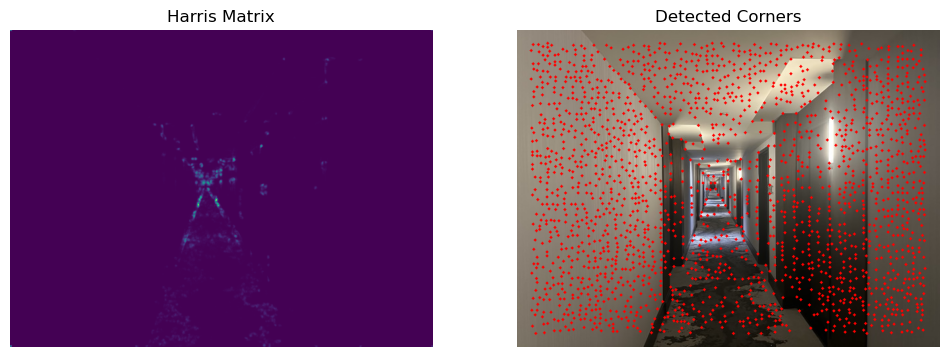
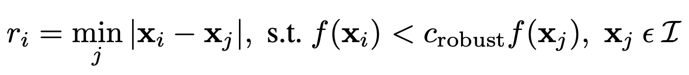
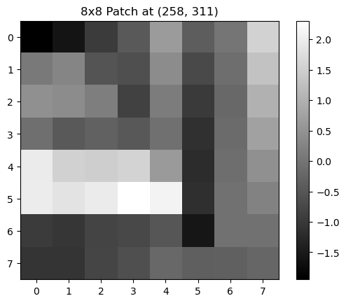
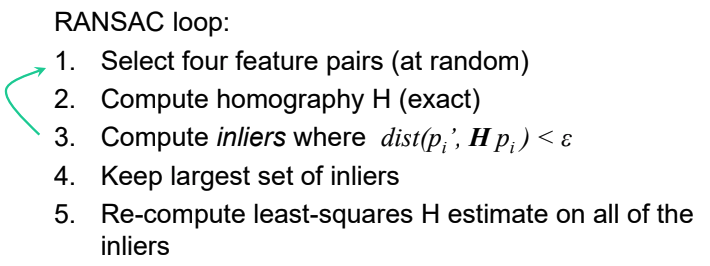
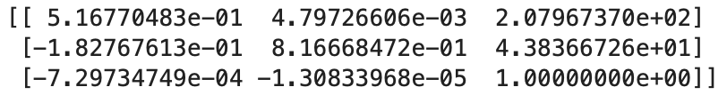
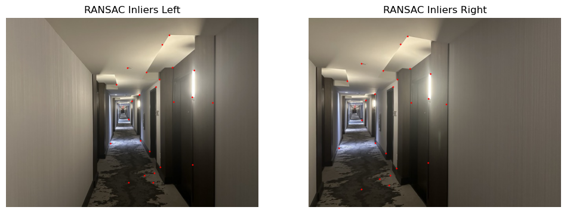
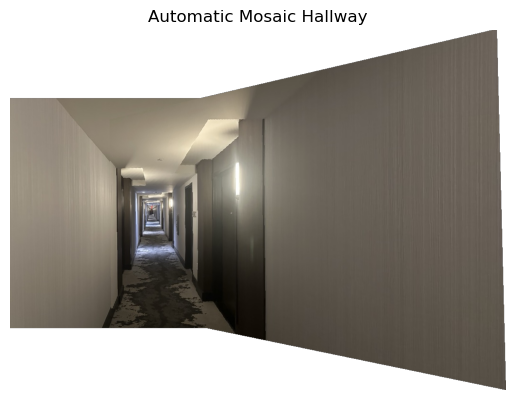
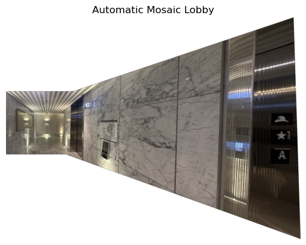
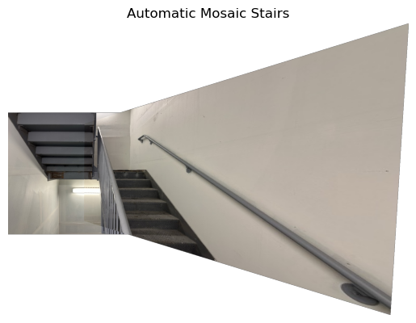

# CS 180 Project 4: Face Morphing
The objective of this assignment is to explore various aspects of image warping and mosaic images together to create a panorama. Throughout this process, the goal is to learn how to compute homographies and use them to warp images as well as reviewing previous learned techniques in blending and warpping. 

# PART A - IMAGE WARPING and MOSAICING

## Shoot and digitize pictures
First, we capture several photos. For each set of images taken together, I kept the center of projection (COP) fixed and only rotated the camera to ensure that the pencil of rays remained consistent. This is crucial for the warping process later on. These images will later be used for warping and mosaicing.

### Flag

  

### Hallway

  
  

### Lobby

  
  

### Stairs

  
  

## Recover homographies
Given the formula below, we want to calculate the homography matrix H, which has 8 unknowns and a 9th entry representing the scaling factor. For each vector `(x, y)`, the vector on the left is the target. Our goal is to map a vector to the target using the homography matrix H. In practice, we define an equal number of points on each image, maintaining the same order, ensuring that these points correspond across images. Then, we select one set of points as the target points for the others.

  

Rearranging the matrix, we obtain the following form for all points. Hence, we solve for the homography matrix H. If we have exactly 8 points, we can solve the system directly. For more than 8 points, we need to minimize noise using the least squares method.

  

## Warp the images
Here are some results of the warpping. 

For a single image, based on the defined points, we can construct a rectangle to be the target points. 
For cases involving multiple images, we can select one set of points from a image as the target points for the others to be warped to. 
For each set of images, I compared the original image with the warped image, as well as the target image with the warped image.

  

For each result below, we first display the comparison between the original image and the warped image, followed by the reference image alongside the warped image.

### Hallway

  

  

### Lobby

  

  

### Stairs

  

  

## Blend images into a mosaic

Next, we use alpha masking to blend the images into a panorama. I created mosaics using two images—one as the reference image and the other warped to align with the reference image. All three results shown below use this approach. I forward-warped the corners and then inverse-warped the polygon for interpolation. To ensure accuracy, I calculated the offset and shifted the image accordingly.

For each warped image, I added an alpha channel to facilitate easier blending. As shown below, the blending appears natural and seamless.

  

  

  

# PART B - FEATURE MATCHING for AUTOSTITCHING

In this part of the project, we will follow the paper [“Multi-Image Matching using Multi-Scale Oriented Patches” by Brown et al.](https://inst.eecs.berkeley.edu/~cs180/fa24/hw/proj4/Papers/MOPS.pdf) to implement a autostitching system for creating image mosaic. 

## 1. Detecting Corner Features

We begin by building a single-scale Harris Interest Point Detector (Section 2). The result for one of the hallway images is shown below. On the left is the Harris matrix, indicating the likelihood of each pixel representing an edge or corner. The high-intensity areas correspond to pixels that have higher probabilities of being corners or edges. On the right, the red dots mark the potential corner points detected in the image. Note that many of these points are not true corners. In the following steps, we aim to optimize these results.

  

## 2. Adaptive Non-Maximal Suppression

In this step, we try to restrict the number of potentional corners while making sure the filtered points are spreaded evenly across the image. The algorithm is described in Section 3 of the paper. In essence, ANMS selects the set of points that provides the best coverage and are most evenly distributed. To achieve this, we first calculate a list of suppressed radii. In the formula below, the function f(x) represents the harris response at the point x. We set the threshold C_robust to be 0.9 for optimal result.

  

Below is the result on the hallway example. We have significantly reduce the number of potential corners compared to the previous result. Currently, the algorithm selects the top 250 coordinates as the optimal corner points.

  

## 3. Extract Feature Descriptors

To further analyze the detected corners, we need to examine the surrounding features. Therefore, we compute a feature descriptor for each selected point. As outlined in Section 4, we extract a 40x40 window around each corner and downsample it to an 8x8 patch. To make the descriptor invariant to changes in intensity, we normalize it to have a mean of 0 and a standard deviation of 1. 

Here is one of the descriptors at the hallway image. 

  

## 4. Feature Matching

Using the descriptors computed in the previous steps, we cross-compare descriptors across images to identify pairs of points with similar features. As suggested in Section 5, we calculate the error rates for the nearest neighbor (1NN) and the second nearest neighbor (2NN) and compute their ratio. A lower ratio indicates a higher likelihood that the 1NN is the correct corresponding pair. In the results below, we  have successfully identified pairs of points with similar features. These are corresponding points across the images.

  

## 5. 4-point RANSAC

Given these matched pairs, we need to find the best homography matrix H that achieve the best warpping result. We use the RANSAC algorithm. 

  

In each iteration, we randomly select four sample pairs to compute a homography matrix H. The best H is the one that results in the most number of inlier points. The loop stops once we reach the maximum number of iterations. Then, we recompute a least-squares estimate of H using all inliers to produce the best H. 

Below is the best H for the hallway example. 

  

Here are the best inliers across images after the RANSAC algorithm. 

  

## 6. Final Result 

For each mosaic result in Part A, we created a mosaic using the autostitching and feature matching techniques described above. For each example, the image on the left shows the manually computed mosaic result from Part A, while the image on the right displays the autostitching result from Part B. Across all three examples, we observe small differences between the two methods, indicating that both produce robust results.  

### Hallway

  
  

### Lobby

  
  

### Stairs

  
  

