

# CS 180 Project 4: Face Morphing
The objective of this assignment is to explore various aspects of image warping and mosaic images together to create a panorama. Throughout this process, the goal is to learn how to compute homographies and use them to warp images as well as reviewing previous learned techniques in blending and warpping. 

## Shoot and digitize pictures
First, we capture several photos. For each set of images taken together, I kept the center of projection (COP) fixed and only rotated the camera to ensure that the pencil of rays remained consistent. This is crucial for the warping process later on. These images will later be used for warping and mosaicing.

### Flag

  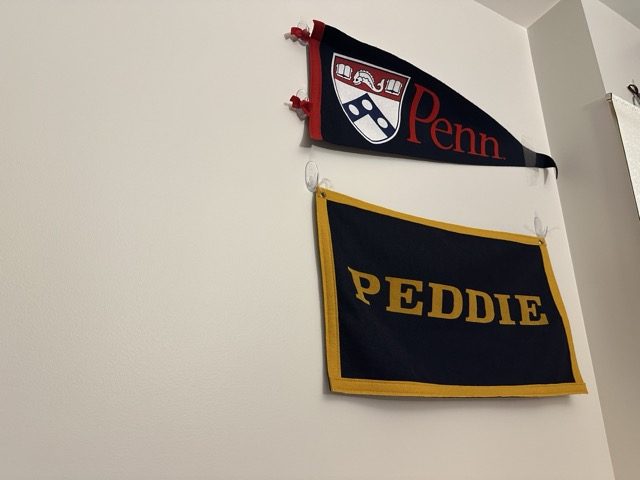

### Hallway

  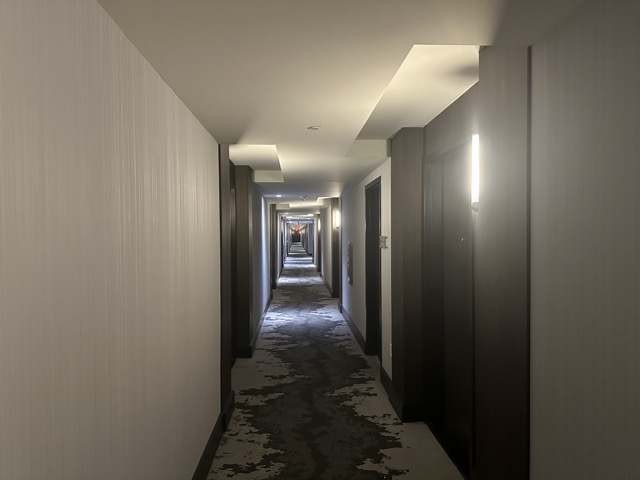
  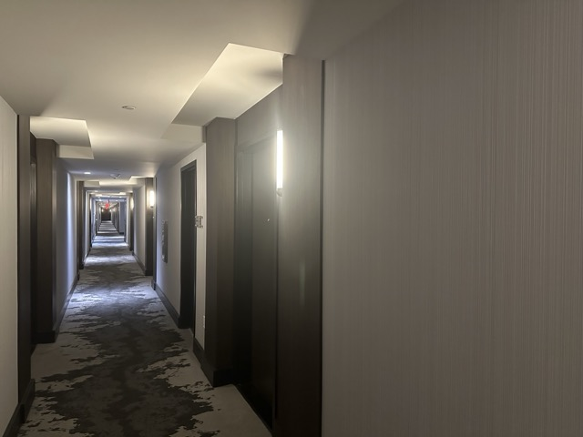

### Lobby

  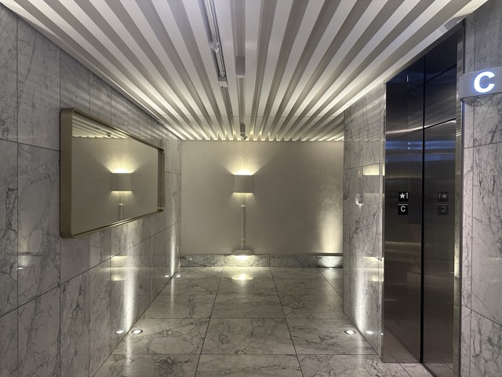
  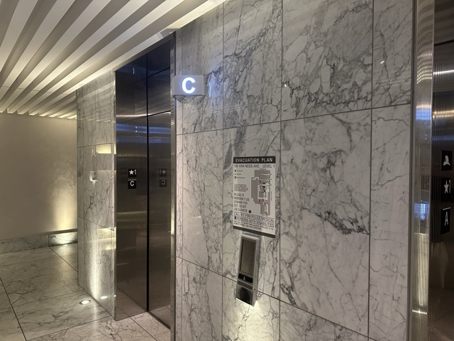

### Stairs

  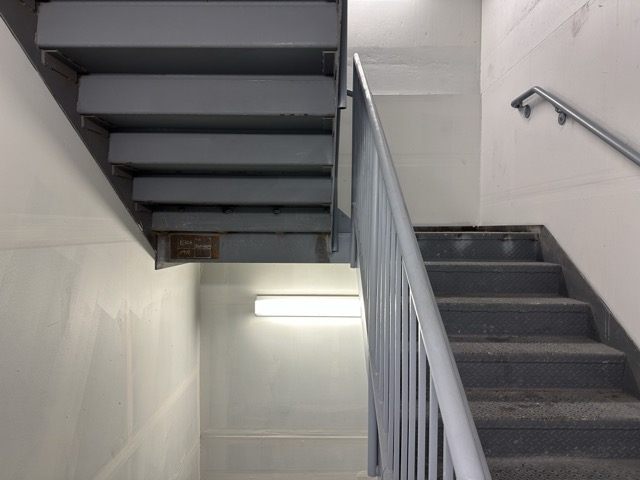
  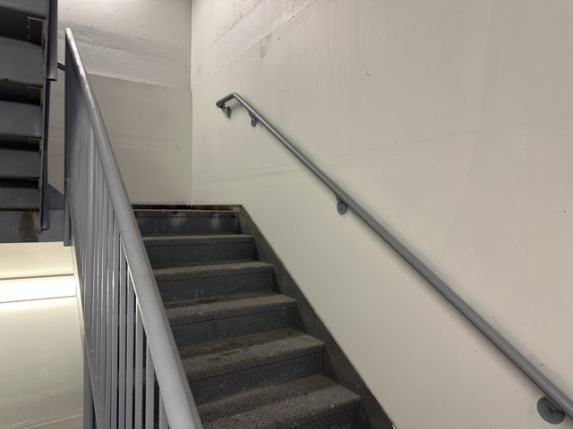

## Recover homographies
Given the formula below, we want to calculate the homography matrix H, which has 8 unknowns and a 9th entry representing the scaling factor. For each vector `(x, y)`, the vector on the left is the target. Our goal is to map a vector to the target using the homography matrix H. In practice, we define an equal number of points on each image, maintaining the same order, ensuring that these points correspond across images. Then, we select one set of points as the target points for the others.

  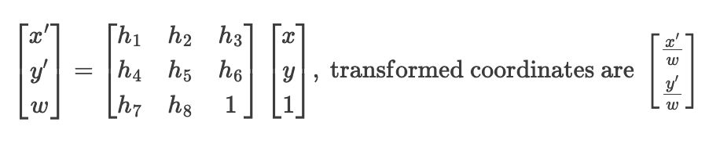

Rearranging the matrix, we obtain the following form for all points. Hence, we solve for the homography matrix H. If we have exactly 8 points, we can solve the system directly. For more than 8 points, we need to minimize noise using the least squares method.

  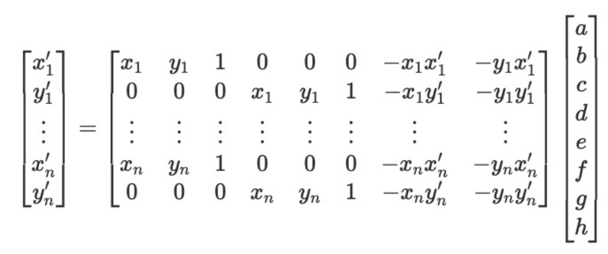

## Warp the images
Here are some results of the warpping. 

For a single image, based on the defined points, we can construct a rectangle to be the target points. 
For cases involving multiple images, we can select one set of points from a image as the target points for the others to be warped to. 

  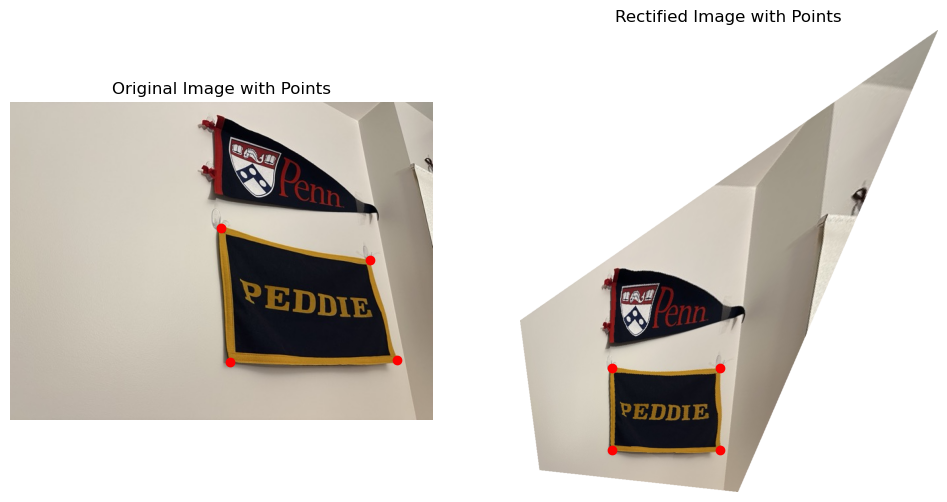

  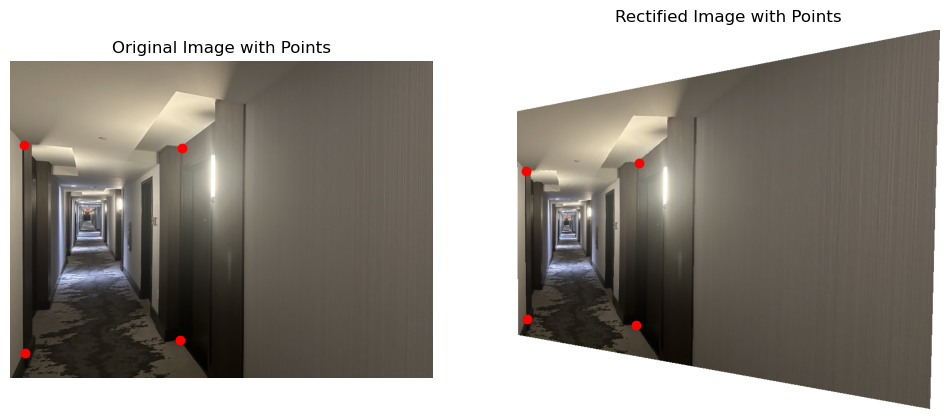

  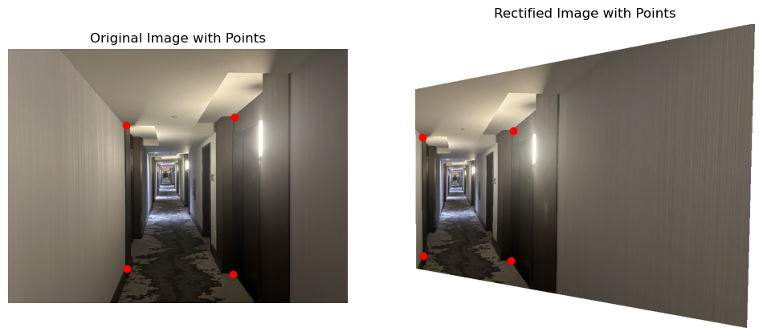

  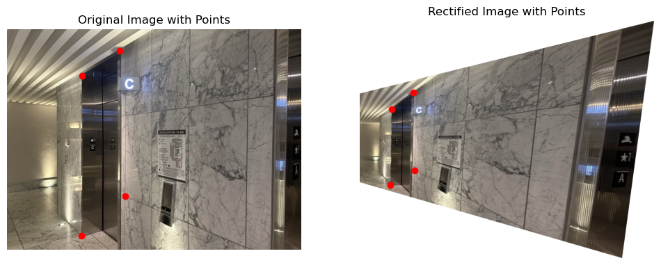

  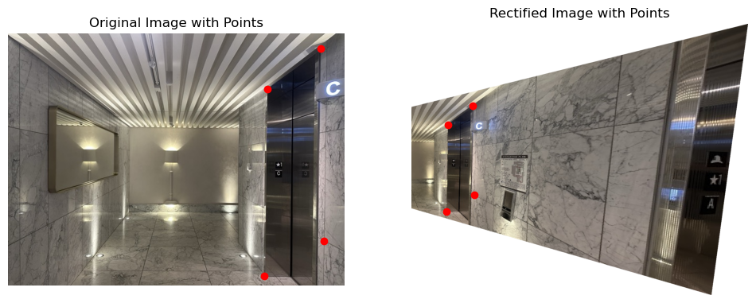

  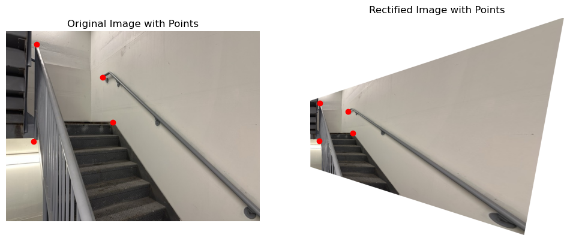

  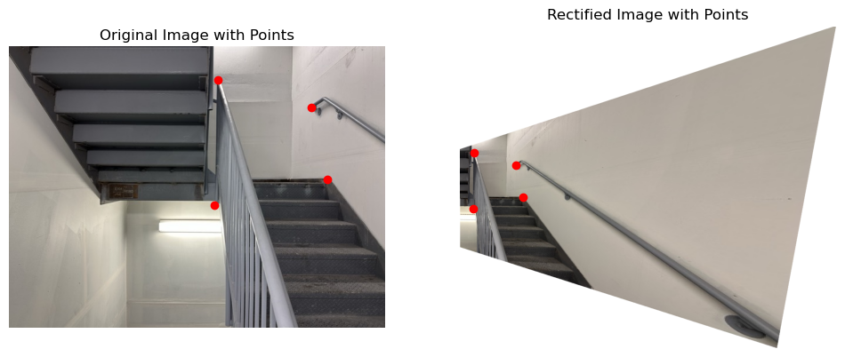

## Blend images into a mosaic

Next, we use alpha masking to blend the images into a panorama. I created mosaics using two images—one as the reference image and the other warped to align with the reference. All three results shown below use this approach. I forward-warped the corners and then inverse-warped the polygon for interpolation. To ensure accuracy, I calculated the offset and shifted the image accordingly.

For each warped image, I added an alpha channel to facilitate easier blending. As shown below, the blending appears natural and seamless.

  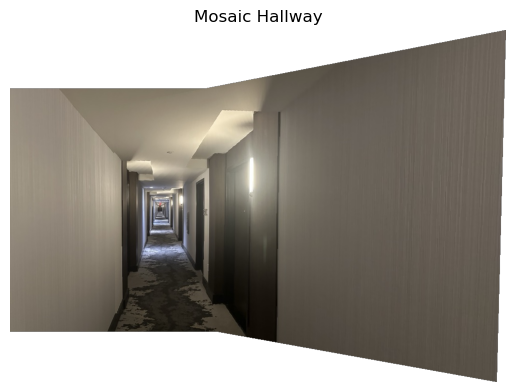

  

  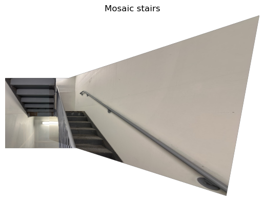

