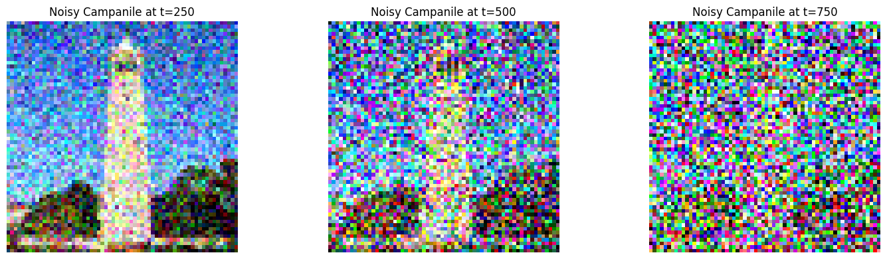
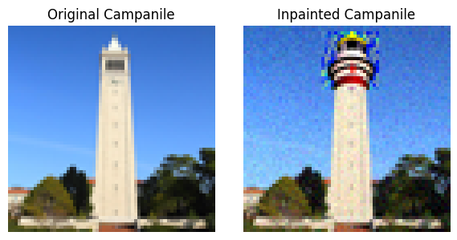
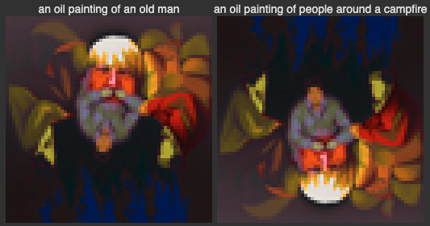
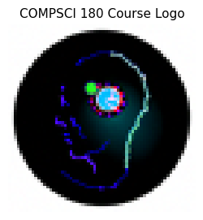

# CS 180 Project 4: Fun With Diffusion Models

For this project, I have set the random seed to be 180 for all tasks. 

## Part 0: Setup

Here is the result of running 3 given prompts on 20 inference steps. 

  

To show the impact of inference step on image quality, we used
`num_inference_steps = 15` and `num_inference_steps = 20`. The results below demonstrate that higher num_inference_steps produce images with more detail. This is most evident in the rocket ship example. The rocket ship generated with 15 inference steps contains simpler shapes and rougher lines compared to the one produced with 20 inference steps. Similarly, the houses in the oil painting of a snowy mountain village produced with 20 inference steps appear more realistic than those in the version generated with 15 inference steps.

`num_inference_steps = 15`

  

`num_inference_steps = 20`

  

## Part 1: Sampling Loops

### 1.1 Implement the Forward Process

The forward process is equivalent to computing

  

We generate a random epsilon of the same shape as the image, sampled from a normal distribution. Next, we extract `alphas_t` from `alphas_cumprod`. Below are the results for `t = [250, 500, 750]`. The results show that as `t` increases, the image contains more noise.

  

### 1.2 Classical Denoising

We use `torchvision.transforms.functional.gaussian_blur` with kernel size of 7 and sigma of 1.5 to achieve the most visually pleasing results. This effectively reduce noise while avoiding oversmoothing. However, we must recognize that this result is not ideal. It is difficult to generate good results.

  

### 1.3 One-Step Denoising

Using pretrained diffusion model to denoise. We use the UNet to denoise the image by estimating the noise. We then subtract the scaled estimated noise from the noise image to obtain an estimate of the original image. Using the equation from 1.1 we are able to get an estimate of `x_0` knowing `x_t`, `alpha_t`, and `epsilon`. 

In the result below, we see that the result become worse as t increases.

  

  

  

### 1.4 Iterative Denoising

Using the formula below, we iteratively compute less noisy images. The provided `add_variance` function ensures the correct amount of variance is added to the image. We add `v_sigma` by calling `add_variance` with the first two terms of (A.3) and `predicted_variance` get `x_t'` with the variance added.

  

To achieve iterative denoising while minimizing computational cost at each step, we use a strided timestep of 30. We create a list of `strided_timesteps` from 990 to 0 with a strided timestep of 30. Starting at `i_start = 10`, we obtain the following results:

  

As `t` decreases, the image becomes progressively clearer. Although it is challenging to fully recover all details, with some elements still lost, the iterative denoising approach significantly outperforms the other two methods previously employed, providing the highest visual quality. Using `i_start = 10` for all methods, `t = 690` for both one-step denoise and Gaussian blur. 

  

### 1.5 Diffusion Model Sampling

We applied the diffusion model to generate 5 images using the prompt “a high quality photo.” Below are the results:

  

### 1.6 Classifier-Free Guidance (CFG)

To achieve higher-quality results, we apply the Classifier-Free Guidance technique. Instead of relying solely on the `noise_est` from the `model_output`, we invoke the UNet model twice: once to generate `model_output` using the prompt “a high-quality photo” and again to produce `uncond_model_output` with an empty prompt "". This approach enhances sample quality without requiring explicit classifier gradients. As shown in the result below, we use a scale of 7 to produce 5 images of "a high quality photo" using CFG. We can see the details are significantly clearer compared to the previous results.

  

### 1.7 Image-to-image Translation

Starting at noise levels [1, 3, 4, 7, 10, 20], we forward process to get a noisy test image and run `iterative_denoise_cfg` to get a seris of "edits" to the original images. The image graudally match the original image as `i_start` increases. 

`Campanillle`

  

`Civic Center`

  

`Big Ben`

  

### 1.7.1 Editing Hand-Drawn and Web Images

To show this procedure on nonrealistic image, we select a cartoon image from the web and 2 hand drawn images. Then, we apply the procedure from 1.7 again on noise levels of [1, 3, 5, 7, 10, 20].

`Orignial Web Image`

  

`Edited at i_start at [1, 3, 5, 7, 10, 20]`

  

`Hand-Drawn Image 1`

  

`Edited at [1, 3, 5, 7, 10, 20]`

  

`Hand-Drawn Image 2`

  

`Edited at [1, 3, 5, 7, 10, 20]`

  

### 1.7.2 Inpainting

Using the approach in `iterative_denoise_cfg`, we incorporate a mask before obtaining `x_t`. This enables us to selectively edit regions where the mask entries are 1 while keeping all other parts of the image unchanged, as illustrated in the formula below. We applied the given mask to the Campanile image and custom masks to our two own images. 

  

`Campanile`

  

`Civic Center`

  

`Big Ben`

  

### 1.7.3 Text-Conditional Image-to-image Translation

Next, we use the prompt “a rocket ship” to demonstrate the transformation of a rocket ship into our original image at noise levels [1, 3, 5, 7, 10, 20].

`Campanile`

  

`Civic Center`

  

`Big Ben`

  

### 1.8 Visual Anagrams

To create visual anagrams, we follow the algorithm below. First, we denoise an image using the first prompt to obtain `noise_est_1`. Next, we flip the image upside down and denoise the flipped image with the second prompt to obtain `noise_est_2`. We then flip `noise_est_2` back upright and average it with `noise_est_1` to compute `noise_est_avg`, which is used to generate the clean estimate image `x_0`. As a result, flipping the image reveals two distinct interpretations that satisfy both prompts. Below are examples of optical illusions created using the diffusion model.

  

  

  

  

### 1.9 Hybrid Images

Now, we create hybrid images using a similar technique. In this approach, we no longer need to flip the image. Instead, we combine the two noise_est results using a low-pass and a high-pass filter. The low-pass filter ensures the image appears coherent from a distance, while the high-pass filter highlights details visible up close.

  

We apply a Gaussian blur with a kernel size of 33 and a sigma of 2 as the low-pass filter. To generate the high-pass filter, we subtract the low-pass result from the original image. Below are three examples of hybrid images generated using the diffusion model.

  

  

  

### Part 2: Bells & Whistles

Using our custom prompts, “an image of a camera lens” and “a neuron,” we created a hybrid image as a logo for CS180 Computer Vision. The neuron symbolizes deep learning, while the camera lens represents the concept of vision. Additionally, we generated another hybrid image using the prompts “a neuron” and “a view of a college campus,” blending the themes of deep learning and academia. 

  

  

