

# CS 180 Final Projects

In this final project, I will work on **Gradient Domain Fusion** and the **Light Field Camera**. For the **Bells & Whistles** component, I will implement **Mixed Blending** in Gradient Domain Fusion.

# Gradient Domain Fusion

The objective of this task is to blend a source object smoothly into a target image. Unlike the Laplacian pyramid blending technique from the previous project, which serves as a comparison, we explore a different approach **that focuses** on preserving the **gradients** of the source region instead of its absolute intensity. Gradients are more perceptually significant to humans, while intensities can be ignored. As a result, the method finds pixel values that retain the source gradients and maintain the target background unchanged. Hence, we frame this problem as a **least-squares** optimization to determine the new intensity values within the source region.

## Part 1 - Toy Problem

We begin with a simple toy problem: reconstructing an image using its x and y gradients along with a single pixel intensity as constraints. The algorithm is described below.

  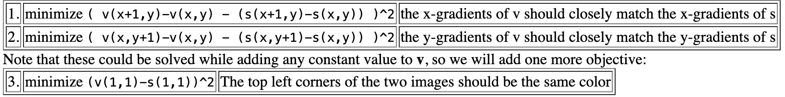

Here are the results:

    <figure>
        
        <figcaption style="text-align: center;">Original Image</figcaption>
    </figure>
    <figure>
        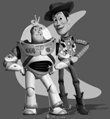
        <figcaption style="text-align: center;">Reconstructed Image</figcaption>
    </figure>

## Part 2 - Poisson Blending

The core algorithm of poisson blend is described by this least square problem below. 

  

To implement this algorithm, we follow three steps:

1. Define the boundaries of a region in the source image and specify its location in the target image where it will be blended.  
2. Solve the blending constraints for each color channel.  
3. Copy the computed values \( v_i \) into the corresponding region of the target image.  

Below are three examples demonstrating the Poisson blending technique. The boundaries between the source and target images are smooth and difficult to detect. 

### Example 1

    <figure>
        
        <figcaption style="text-align: center;">Penguin 1</figcaption>
    </figure>
    <figure>
        
        <figcaption style="text-align: center;">Background 1</figcaption>
    </figure>

    <figure>
        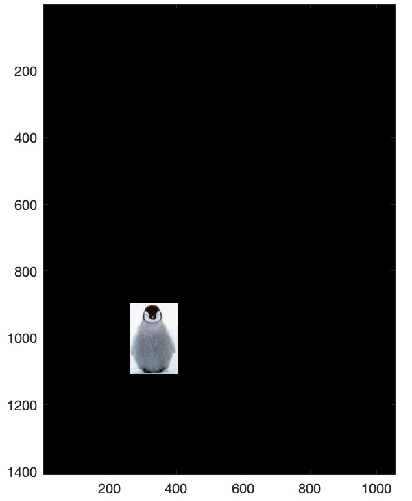
        <figcaption style="text-align: center;">Mask</figcaption>
    </figure>
    <figure>
        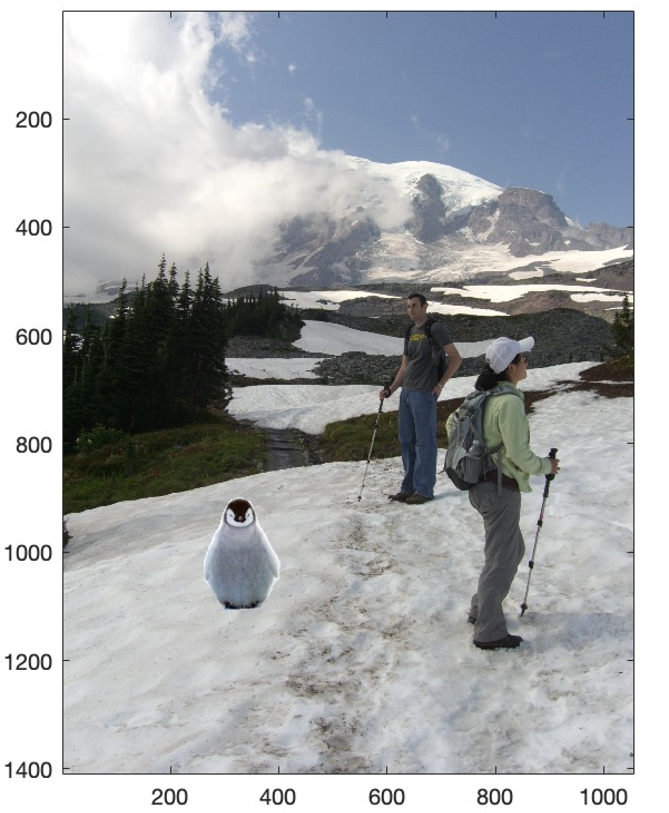
        <figcaption style="text-align: center;">Unblended</figcaption>
    </figure>
    <figure>
        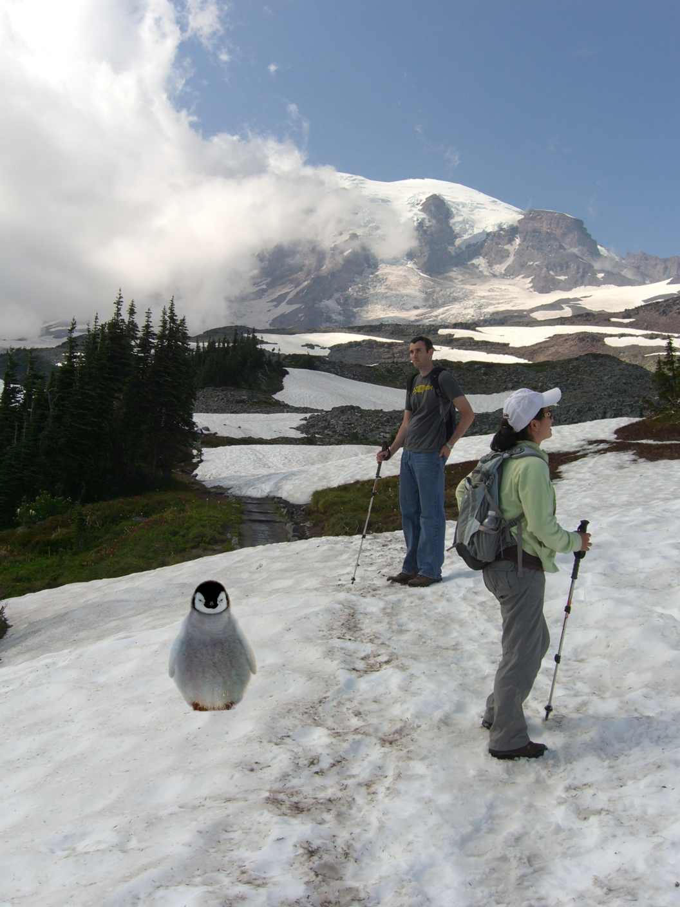
        <figcaption style="text-align: center;">Poisson Blended</figcaption>
    </figure>

### Example 2

    <figure>
        
        <figcaption style="text-align: center;">Penguin 1</figcaption>
    </figure>
    <figure>
        
        <figcaption style="text-align: center;">Background 2</figcaption>
    </figure>

    <figure>
        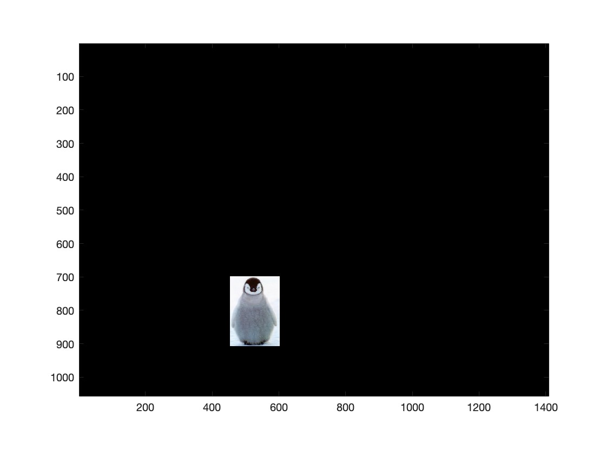
        <figcaption style="text-align: center;">Mask</figcaption>
    </figure>
    <figure>
        
        <figcaption style="text-align: center;">Unblended</figcaption>
    </figure>
    <figure>
        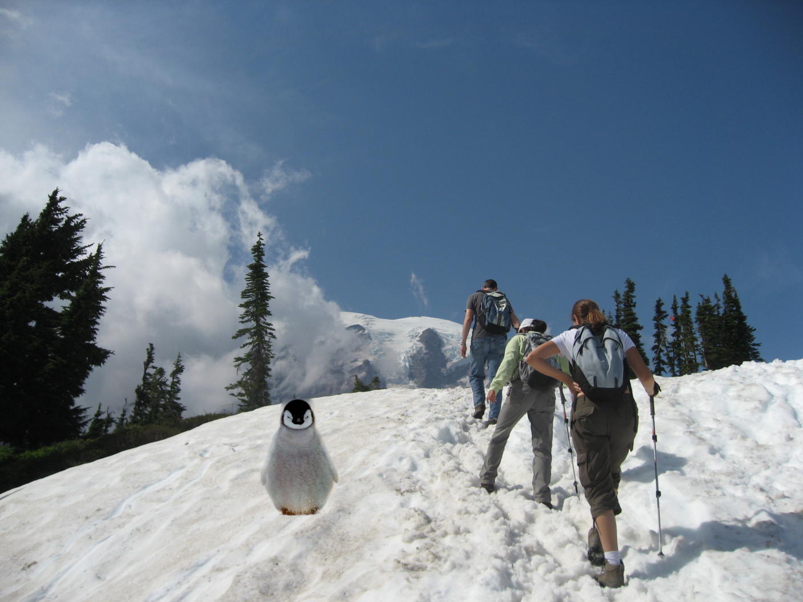
        <figcaption style="text-align: center;">Poisson Blended</figcaption>
    </figure>

### Example 3

    <figure>
        
        <figcaption style="text-align: center;">Penguin 2</figcaption>
    </figure>
    <figure>
        
        <figcaption style="text-align: center;">Background 2</figcaption>
    </figure>

    <figure>
        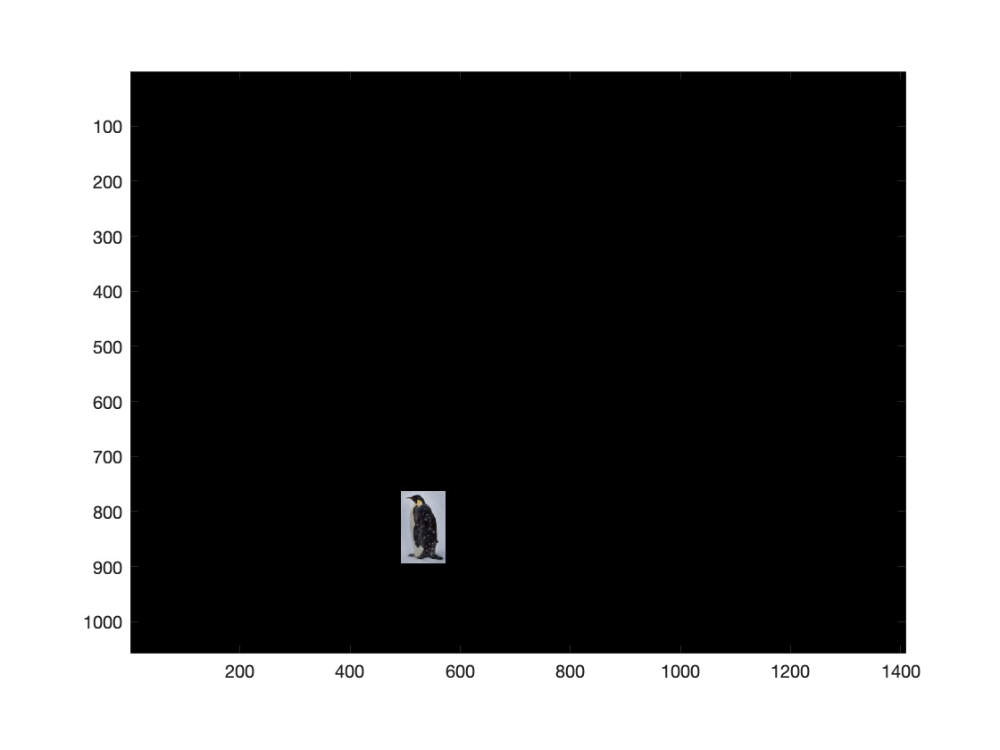
        <figcaption style="text-align: center;">Mask</figcaption>
    </figure>
    <figure>
        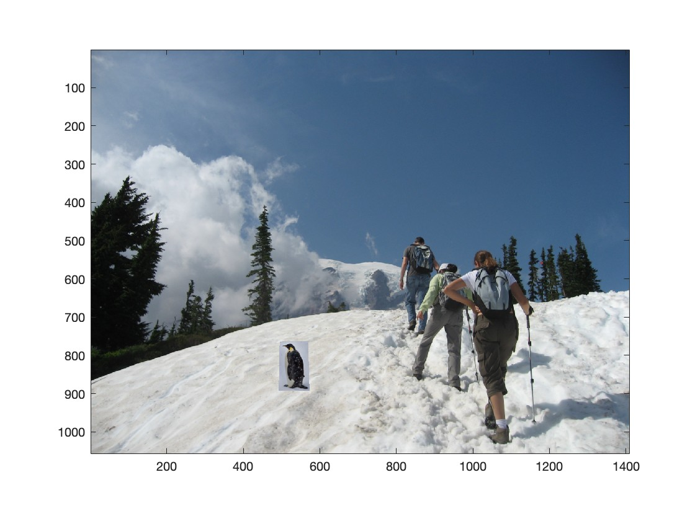
        <figcaption style="text-align: center;">Unblended</figcaption>
    </figure>
    <figure>
        
        <figcaption style="text-align: center;">Poisson Blended</figcaption>
    </figure>

## Bells & Whistles - Mixed Gradients 

For mixed gradients, we use $ max(d_s, d_t) $ as the guiding gradient instead of relying solely on the source gradient. All other steps remain the same to the Poisson blending process. This approach can produce smoother and more natural blending results.

  

### Example 

    <figure>
        
        <figcaption style="text-align: center;">Penguin</figcaption>
    </figure>
    <figure>
        
        <figcaption style="text-align: center;">Background</figcaption>
    </figure>

    <figure>
        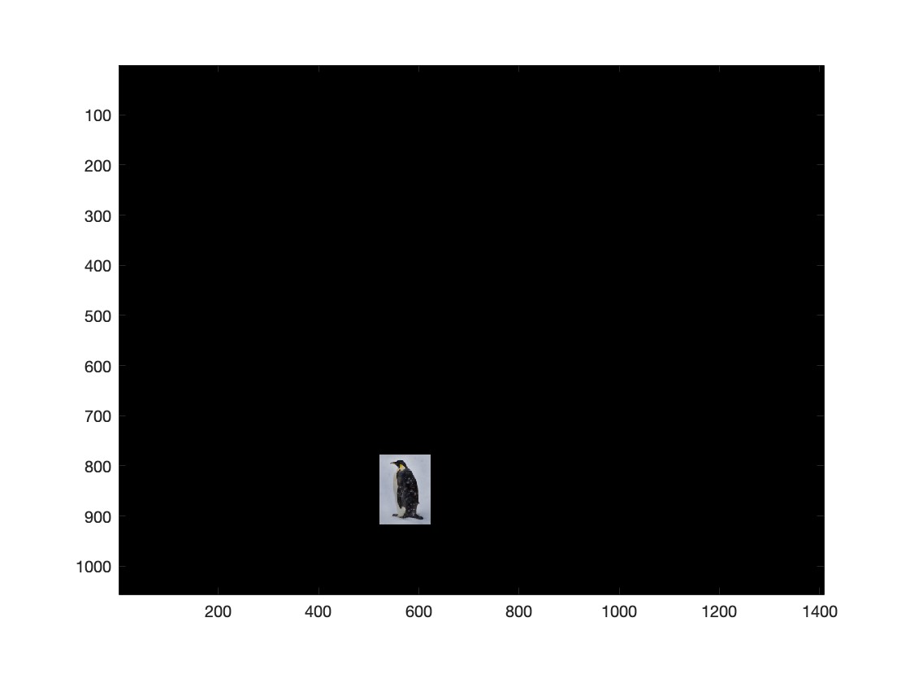
        <figcaption style="text-align: center;">Mask</figcaption>
    </figure>
    <figure>
        
        <figcaption style="text-align: center;">Unblended</figcaption>
    </figure>
    <figure>
        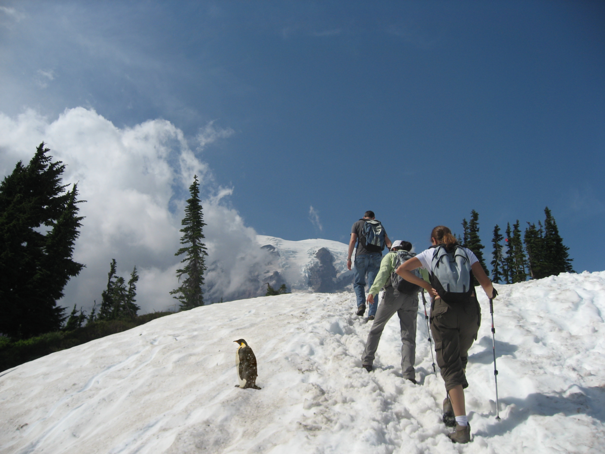
        <figcaption style="text-align: center;">Mixed Blended</figcaption>
    </figure>

# Lightfield Camera

In this project, we use a simple averaging technique on lightfield images to reproduce effects at varying depths and apertures. The technique requires images captured over a regularly spaced grid. It was first introduced in this paper:

  <a href="https://graphics.stanford.edu/papers/lfcamera/lfcamera-150dpi.pdf" target="_blank">
     <i>Light Field Photography with a Hand-held Plenoptic Camera</i>  by Ng et al.
  </a>

## Part 1 - Depth Refocusing

To refocus depth, we exploit the **parallax effect** using images captured over a regularly spaced grid. By applying two simple operations—**shift** and **average**, we can simulate focusing at varying depths.

- **Shifting Images**: We fix the center of the grid and shift other images by their distance from the grid center, multiplied by the scale: $ \alpha \times (8 - dx, 8 - dy) $. In this way, images taken from different viewpoints are spatially shifted to account for parallax. The shift aligns objects at the desired depth while leaving objects at other depths misaligned.  

- **Averaging**: Once the images are aligned, we average pixel-by-pixel. This enhances the sharpness of objects at the target depth while blurring objects elsewhere, simulating a depth focus effect.

In the results below, we show the scale varying from **-2 to 2** with a step size of **0.2**. Initially, the image appears blurry at **-2** because the objects are heavily misaligned. As the scale increases toward **0**, the alignment improves, and objects at a specific depth come into sharp focus, resulting in a clearer image. Beyond this point, the alignment deteriorates as the scale continues to increase and causes the image to blur.

## Part 2 - Aperture Adjustment

The **aperture adjustment** technique simulates the effect of changing a camera's aperture size in light field imaging. By averaging images within a specified radius around the center of a grid, it controls how much information from neighboring viewpoints contributes to the final image. A smaller aperture includes fewer images, while a larger aperture averages more images.

In the results below, we show the aperture radius varying from **0 to 8**. With a total of 289 images arranged in a **17x17 grid**, the maximum possible radius is **8**. As demonstrated, increasing the aperture radius incorporates more images into the averaging process. 

## Summary

It is surprising to see these results using such simple techniques. After completing this project, I start to appreciate two key observations:
1. A deep understanding of the relationship between viewpoints and the **parallax effect**.  
2. The ability to simulate aperture size and depth focus effects using **averaging** technique.

